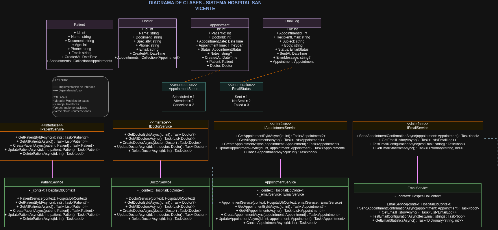
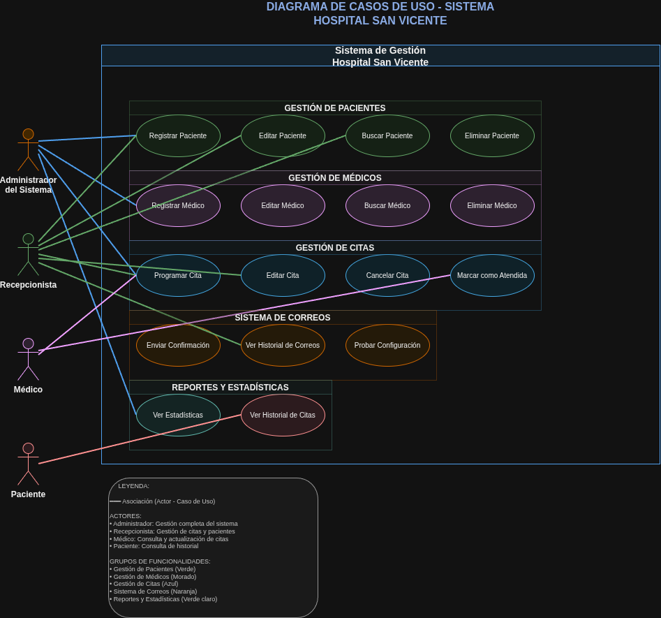
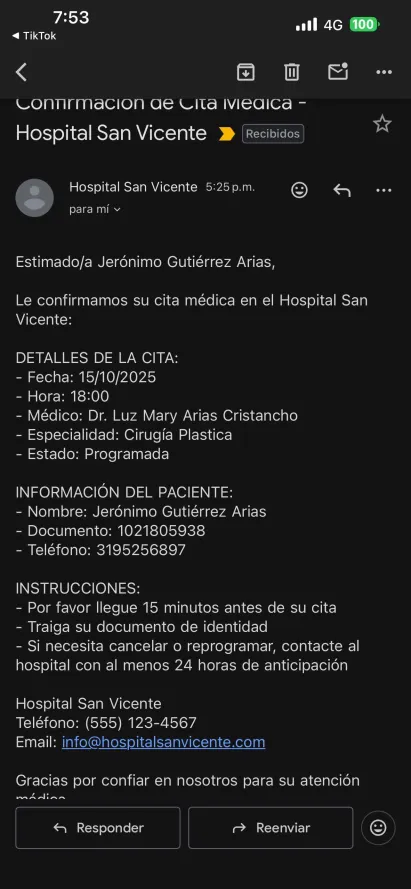

# Hospital San Vicente Management System

## Description

Console application developed in C# for the digital management of medical appointments, patients, and doctors at Hospital San Vicente. Eliminates dependency on manual records and automates appointment scheduling with conflict validations.

## Main Features

### Patient Management
- Patient registration, editing, search, and deletion
- Unique document validation
- Patient appointment history

### Doctor Management
- Doctor registration, editing, search, and deletion
- Filtering by specialty
- Doctor appointment history

### Appointment Management
- Scheduling with time conflict validation
- Cancellation and marking as attended
- Listing by date, status, patient, or doctor
- Automatic confirmation email sending

### Notification System
- Automatic email sending using Gmail SMTP
- Complete sending history with statuses
- Professional format with complete information

### Statistics
- Patient, doctor, and appointment counters
- Statistics by appointment status
- Email metrics

## Technologies

- **.NET 8.0** - Development framework
- **Entity Framework Core** - ORM for data access
- **MySQL** - Remote relational database
- **MailKit** - Email sending
- **Dependency Injection** - Dependency injection

## Installation

### Requirements
- .NET 8.0 Runtime
- Internet access (for MySQL database)

### Steps
1. Clone the repository
2. Restore dependencies: `dotnet restore`
3. Build: `dotnet build`
4. Run: `dotnet run`

### Database Configuration
The system automatically connects to a remote MySQL database:
- **Host:** 168.119.183.3:3307
- **Database:** PruebaDeDesempeñoJeronimo
- Tables are created automatically

### Email Configuration
Configuration in `appsettings.json`:
```json
{
  "EmailSettings": {
    "SmtpHost": "smtp.gmail.com",
    "SmtpPort": 587,
    "SmtpUsername": "hospitalsanvicenteriwi@gmail.com",
    "SmtpPassword": "qjws fxmc zxcd bdnm",
    "FromName": "Hospital San Vicente",
    "FromEmail": "hospitalsanvicenteriwi@gmail.com"
  }
}
```

## Project Structure

```
HospitalSanVicente/
├── Data/
│   └── HospitalDbContext.cs          # Entity Framework Context
├── Models/
│   ├── Patient.cs                    # Patient Model
│   ├── Doctor.cs                     # Doctor Model
│   ├── Appointment.cs                # Medical Appointment Model
│   └── EmailLog.cs                   # Email Log Model
├── Services/
│   ├── IPatientService.cs            # Patient service interface
│   ├── IDoctorService.cs             # Doctor service interface
│   ├── IAppointmentService.cs        # Appointment service interface
│   ├── IEmailService.cs              # Email service interface
│   ├── IHospitalUIService.cs         # UI service interface
│   ├── PatientService.cs             # Business logic implementation
│   ├── DoctorService.cs              # Business logic implementation
│   ├── AppointmentService.cs         # Business logic implementation
│   ├── EmailService.cs               # Business logic implementation
│   └── HospitalUIService.cs          # User interface implementation
├── Utils/
│   ├── ValidationHelper.cs           # Validation utilities
│   └── ErrorHandler.cs               # Centralized error handling
├── diagrams/
│   ├── Diagrama_Clases_Hospital.xml  # Class diagram XML file
│   ├── Diagrama_Casos_Uso_Hospital.xml # Use case diagram XML file
│   ├── Diagrama_Clases_Hospital.drawio.png # Class diagram image
│   └── Diagrama_Casos_Uso_Hospital.drawio.png # Use case diagram image
├── media/
│   ├── correo_confirmacion_cita.png  # Appointment confirmation email screenshot
│   └── demo_sistema_completo.mp4     # Complete system demo video
├── appsettings.json                  # Application configuration
├── Program.cs                        # Entry point and main flow
├── HospitalSanVicente.csproj         # Project file
└── README.md                         # Project documentation
```

## System Usage

### Main Menu
1. **Patient Management** - Manage patient information
2. **Doctor Management** - Manage doctor information
3. **Medical Appointment Management** - Schedule and manage appointments
4. **Email History** - View sent email logs
5. **System Statistics** - View general system summary
0. **Exit** - Close the application

### Main Operations

#### Patient Management
- **Register**: Name, unique document, age, phone, email
- **Edit**: Modify existing fields
- **Search**: By name, document, or email
- **Delete**: With future appointment validation

#### Doctor Management
- **Register**: Name, unique document, specialty, phone, email
- **Edit**: Modify medical information
- **Search**: By name, document, or specialty
- **Delete**: With future appointment validation

#### Appointment Management
- **Schedule**: Patient ID, doctor ID, date, time, optional notes
- **Cancel**: Change status to "Cancelled"
- **Mark as attended**: Change status to "Attended"
- **List**: By date, status, patient, or doctor

## Validations and Business Rules

### General Validations
- Unique documents in the system
- Age between 1 and 150 years
- Valid email format
- Correct date and time format
- No appointments in past dates

### Appointment Validations
- A doctor cannot have two appointments at the same time
- A patient cannot have two appointments at the same time
- Patient and doctor must exist in the system
- Cannot delete future appointments without cancelling them first

## Architecture

### Design Patterns
- **Repository Pattern**: Services encapsulate data access logic
- **Dependency Injection**: Dependency injection for services
- **Clean Architecture**: Clear separation of responsibilities
- **Separation of Concerns**: UI separated from business logic

### Layers
1. **Presentation**: Console interface (Program.cs + HospitalUIService.cs)
2. **Business Logic**: Services (Services/)
3. **Data Access**: Entity Framework (Data/)
4. **Models**: Domain entities (Models/)
5. **Utilities**: Validations and error handling (Utils/)

### Advanced OOP
- **Interfaces**: IPatientService, IDoctorService, IAppointmentService, IEmailService, IHospitalUIService
- **Abstraction**: Well-defined contracts for extensibility
- **Dependency Injection**: Centralized configuration in Program.cs

## UML Diagrams

### Class Diagram


Shows the complete system structure with models, interfaces, implementations, and relationships.

### Use Case Diagram


Illustrates interactions between actors (Administrator, Receptionist, Doctor, Patient) and system functionalities.

## System Demonstration

### Appointment Confirmation Email


The system automatically sends professional emails with complete appointment information.

### Demo Video
[Watch Complete Demo Video](media/demo_sistema_completo.mp4)

Video showing all system functionalities working in console.

## Database

### Table Schema

#### Patients
- `Id` (PK), `Name`, `Document` (unique), `Age`, `Phone`, `Email`, `CreatedAt`

#### Doctors
- `Id` (PK), `Name`, `Document` (unique), `Specialty`, `Phone`, `Email`, `CreatedAt`

#### Appointments
- `Id` (PK), `PatientId` (FK), `DoctorId` (FK), `AppointmentDate`, `AppointmentTime`, `Status`, `Notes`, `CreatedAt`

#### EmailLogs
- `Id` (PK), `AppointmentId` (FK), `RecipientEmail`, `Subject`, `Body`, `Status`, `ErrorMessage`, `SentAt`

## Useful Commands

### Development
```bash
dotnet restore    # Restore packages
dotnet build      # Build project
dotnet run        # Run application
dotnet clean      # Clean project
```

### Database
```bash
dotnet tool install --global dotnet-ef  # Install EF Core tools
dotnet ef migrations add MigrationName  # Create migration
dotnet ef database update  # Apply migrations
```

## Project Status

### Completed Features
- Complete management of patients, doctors, and appointments
- Functional email system with Gmail SMTP
- Robust validations in all fields
- Centralized error handling in Spanish
- Clean architecture with separation of responsibilities
- Professional and easy-to-use user interface
- Advanced OOP with interfaces and dependency injection

---

**Developed by:** Jerónimo Gutiérrez Arias  
**Clan:** Van Rossum  
**Email:** jeronimogutierrezarias@outlook.com  
**Document:** 1021805938
